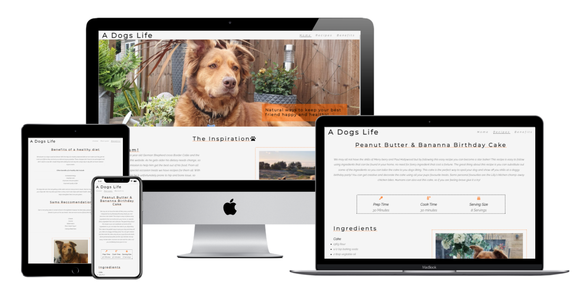
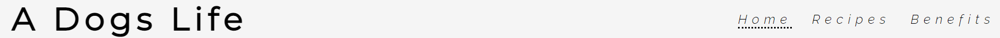
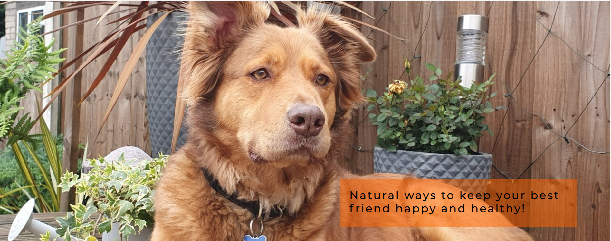
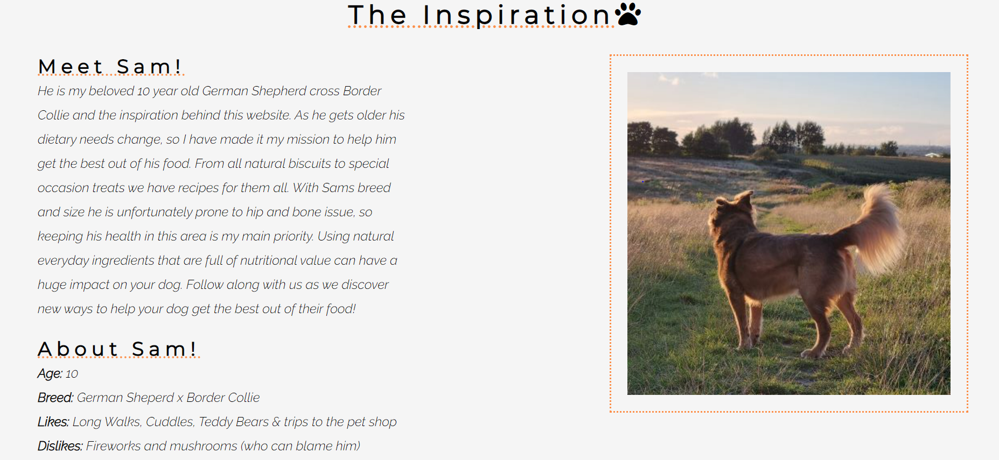
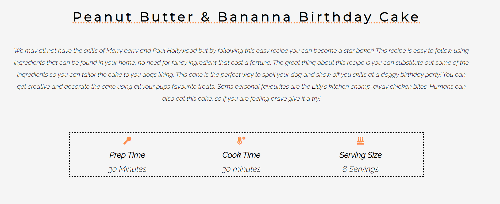
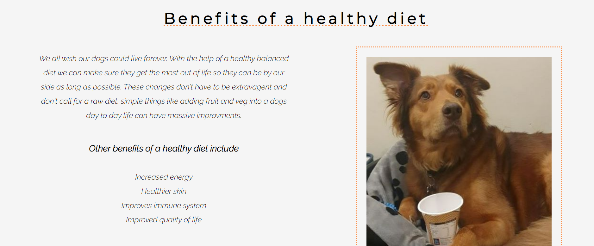
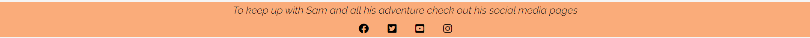
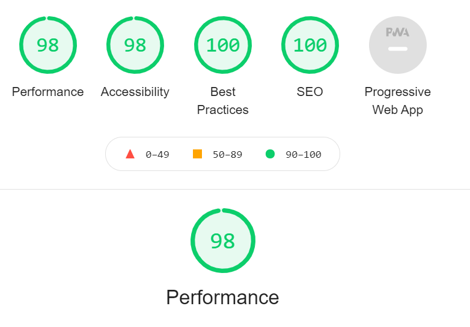

# A Dogs Life

A dogs life is a site for those who want to get the best out of their dogs diet and explore new ways in which food can benefit their dogs life. The aim of this site is to provide reciepes and information for those who are wanting to introduce more natural and helthy alternatives into their dogs diet. The idea behind this site is that its very overwhelming as a dog owner to find the right information and reciepes that are safe for dogs. Like me many owner like to know what is going into their dogs treats so providing a portal for recipes to be all in one easy accesible will give owns an option to make their own treeats and tailor them to what their dog likes.

## Features

* Navigation Bar
    * The implimentation of the navigation bar that features on all 3 of pages of the site allow for site viewer to easily be able to navigate from page to page therfore resulting in them spending more time on the site exploring all the different features. 
    * This feautre being in the same place on all pages means the site viewer will be able to find this easily and will avoid any confusion that may lead to a negative user experience.
    * The use of the Orange and Black hover action helps viewers differenciate between what page they are currently on and what they are hovering over, this will help avoid them clicking on the page they are currently on.

     

* Home Page Image & Text
    * The home page image is used to get the attention of the site viewer, this then reasures them that the page is about dogs. This image also sets focus on the basis on the colour scheme that runs across the site and helps tie everything in together. 
    * The use of the text feautre on top of the image gives a brief description of what the site is about. The orange background helps make the text stand out from the picture so it is easily readable. 

     

* Inspiration & about Sam section 
    * This section shows the inspiration and purpose behind the site, this will help users connect and relate more to the site. this will help show that we are putting these recipes into practice. 
    * The about Sam section just shows them a little more into the inspiration, it gives a personal touch and answers any questions regarding breed and age.
    * The use of a picture and border next to the text gives a visual image of Sam that is eyecatching. This also helps balance out the page so viewers don't find it too overwhelming 
    
    

* Recipes page 
    * This page is one of the main pages where users can currently find a dog friendly recipe for a peanut butter and bananan cake, they will be able to find everything they need to make the cake for themselves. This includes the ingredient list for both the cake and frosting and the instructions. Having this all in one place means the users has all the infomation avaliable on one page making it easier to use when baking the cake.
    * The image on the page helps show a visual of what the cake looks like so views know what they are able to bake. 
    * The notes section at the bottom gives recomendation on subsitutes you can you if you don't have bananas, this means the users can use this recipe over and over aagin and impliment a different subsitute each time.

    

* Benefits page 
   * This page shows site viewers a few of the many benefits of your dog having a healthy diet.It gives exapmles of what results you may be able to see after implimenting healthier treats into your dogs daily diet. 
   * Sams reccomendation helps give the site a personal touch and shows a little bit on insight into him. These reccomendation will also help users who are not sure where to start when it comes to introducing healthy foods into their dogs diet

   

* Footer to Sams social media platforms
  * The footer at them bottom of all pages links to Sams social media sites so users can keep up to date with all the things we are trying and adventures we go on.
  * These links also open in a new tab so the user dosen't lose the page they are on creating a negative user ecxperience.

  

### Features left to impliment
 * I would like to implement more reciepes into the recipe page so users have more choice regarding recipes. 
 * Another section i would want to add is a blog styled page where users can keep up to date on all the activites and foods that Sam and I try. 
 * In the future i would like to impliment a Chat/ Forum function so people can connect with one and another and discuss what recipes they have that they like and other tips for a healthy dog.

## Testing
When it came to testing my site page i have ensured that all the pages work are are linked properly, i also tested the social media links to make sure that these all worked and opened in a new tab. 
* I tested this on chrome, edge and on mobile devices
* I tested that is was recponsive on all devices using dev tools 

### Bugs 
When i deployed my page i diecovered that my pictures were not visible due to using an absolut file path instead of a relative style path. 
 * To fix this bug i changed all my image paths to relative paths by taking of the "/" at the begining 
  * Once i had made these changes the pictures shows on the brower

Another issue i found that was when i tested the page on my personal device the pictures did not show up in the place i wanted them to. 
  * I fixed this by making changed to my responsive design so the the pictures were where i wanted them and were not cut of the edge of the screen when on a smaller device.
  * I replaced my header and heading text so that everything was readable on a phone.
  

## Validator testing
* HTML 
   * No errors were found when it was ran through the W3C validator

* CSS  
   *  No errors were found when it was ran through the (Jigsaw) validator

## Unfixed Bugs
No unfixed bugs 

## Deployment
I deployed my site using github using the following process: 
1. Go to your git hub repositories and click on the repository you want to deploy 
2. Go into the settings page, this can be found across the top bar 
3. Then find the pages tab, this can be located on the left hand side
4. Once you are on the pages tab find the source section.
5. The source section will contain a drop down menu.
6. From this drop down menu select the main branch
7. After you have done this click save. 
8. The page will then refresh and a banner will appear with the live link to your page 
9. Finally click the link and this will take you to the live page. 

Notes the live page may take a few minutes to be deployed so may not work straight away 

The live link to my website can be found below:

https://charreek.github.io/project-1/benefits.html 

## Credits 

### Media 
All pictures used are my own of my dog 

### Content 
* The code used for the footer was taken from the Code Insitute Love Running Project
* Recipe is from based of one from: http://www.bakedbyjoanna.com/2011/08/banana-carob-oat-cake-with-peanut-butter-frosting.html
* Sven Lowry_5P from slack helped me fixed my footer issue code - clear:both
* I used the bolier plate lesson from love running to help set up the basic structure of my page 
